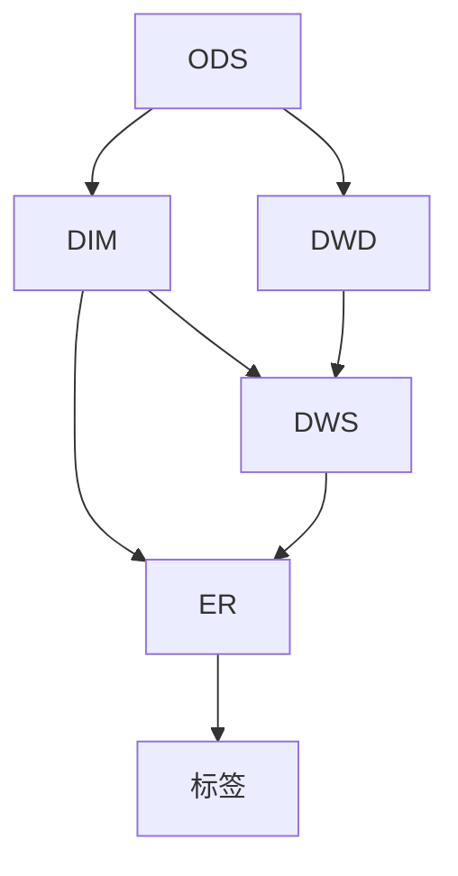

# 智能打标调研（佳兆业·文体用户数据库）

> 面向「佳兆业文体」用户数据库的企业级技术调研与打标模拟项目。
> 目标是：在排除基础客观标签、规则标签、统计标签等传统常规打标方法的前提下，
> 探索**机器学习/深度学习方法**在用户打标场景中的工程化落地，并选取**两个**场景
> （分别对应 **无监督聚类** 与 **有监督预测(XGBoost)**）在测试环境跑通打标流程模拟。

---

## 1. 项目目标

1. **方法调研**：联网调研"机器学习给用户打标"工程上常用的方法，提炼可复用方法库。
2. **两个场景 + 两类标签 + 两种方法**：
   - **场景 A（DWS 直算，不需 ER 层）**：产出【行为/属性类标签】，方法=无监督聚类（备选预测）。
   - **场景 B（DWS 直算，不需 ER 层）**：产出【概率型流失标签】，方法=**XGBoost 预测模型**（已由「图嵌入」调整）。
3. **打标模拟**：用测试库数据各跑通一条"特征 → 算法 → 标签"链路，验证可行性。

## 2. 边界与关注点

| 关注 | 说明 |
|---|---|
| 排除的内容 | 基础客观标签（性别、年龄、城市等直采字段）、规则标签（if-then 阈值）、基本统计标签（计数/均值/频率）。这些不需要机器学习。 |
| 保留的内容 | 聚类、预测、嵌入/表征等**智能方法**产出的标签。 |
| 两场景原则 | 场景 A 直接吃 DWS 用户宽表（一行一用户，行为窗口特征），方法=聚类；场景 B 同样 DWS 直算（观察窗→特征、标签窗→y），方法=**XGBoost 预测**。两者各配一种方法（无监督聚类 + 有监督预测），避免摊大饼。 |
| 分工边界 | **ER 层由另一位同事负责**（我方只消费其产出的关系数据）；我方负责"标签层"（含从 DWS 直算的标签、以及基于 ER 关系计算的标签）。 |

### ⚠️ 重要建模前提（数据质量假设）

- **测试环境不可信**：测试库大量字段乱填，**不直接基于测试数据及其特征**设计/评估方案。
- **以"表名 + 字段名 + 字段注释"为第一依据**理解业务与数据关系。
- **假设生产环境数据质量基本合格**：方案面向生产可行性设计；测试库仅用于"链路跑通"模拟，结果不追求质量，也不作为标签效果的判断依据。

## 3. 数仓分层背景（同事提供，含最新分工）



- **ER 层（关系）**：由另一位同事负责。我方只需消费其产出（用户×资源 等关系数据），不做该层建设。
- **我方**：负责【标签层】。场景 A 的标签直接从 DWS 计算（聚类），场景 B 的预测标签同样从 DWS 直算（观察窗特征 + 自造标签窗 y，XGBoost）。两场景均不再依赖 ER 层即可落地。
- 分层科普、是否精简、DWS 建设偏好答复：见 [02_方法调研/数仓分层_ER层与DWS偏好.md](02_方法调研/数仓分层_ER层与DWS偏好.md)。

## 4. 数据源（测试环境）

- 表结构定义：工作区根目录 [ods_wenti_starrocks.sql](../../ods_wenti_starrocks.sql)（StarRocks ODS 层，三套源系统汇聚）。
- 本机可通过 Navicat 直连访问测试库。

### 数据库连接信息

Mysql数据库：192.168.112.101  3306   mysql5.7
用户名：readonly_jnl
密码：Rjnl@20250101

## 5. 目录结构

```
智能打标调研/
├── README.md                                    # 本文件
├── PLAN.md                                      # 总体计划（双场景）
├── 02_方法调研/
│   ├── 方法流程与可行性.md                       # 6类方法+流程+优先级+入门讲解 ✅
│   ├── 场景标签与方法匹配.md (迁移至03)          # (已迁移)
│   ├── 硬件资源与CDP调研.md                     # 资源矩阵+CDP对接清单 ✅
│   └── 数仓分层_ER层与DWS偏好.md                 # ER科普+DWS答复草稿 ✅
├── 03_场景与标签需求/
│   └── 场景标签与方法匹配.md                     # 6场景→标签→方法匹配表 ✅
├── 04_方案设计与实施/
│   ├── 场景A_方案设计与打标模拟.md                # 场景A设计+质量诊断 ✅
│   ├── 场景B_方案设计与打标模拟.md                # 场景B流失预测全链路 ✅
│   ├── scripts/
│   │   └── sceneA_clustering_demo.py           # 场景A完整打标脚本 ✅
│   ├── sceneB/                                 # 场景B 自包含子目录
│   │   ├── 脚本 scripts/
│   │   │   ├── sceneB_synth_data.py            # 模拟ODS数据生成(纯stdlib)
│   │   │   ├── sceneB_featurize.py             # 特征宽表+自造标签(防泄漏)
│   │   │   ├── sceneB_llm_augment.py           # LLM增强(pluggable+mock回退)
│   │   │   └── sceneB_train_xgboost.py         # XGBoost训练+评估+增量重训
│   │   ├── sql/sceneB_ods_to_dws.sql           # ODS→DWS特征/标签表增量SQL
│   │   ├── config/llm_config.json              # 本地LLM接入配置
│   │   └── output/                             # 场景B产物
│   │       ├── raw/                            # 模拟ODS原始层(users/events/label)
│   │       ├── features.csv / split.json       # 特征宽表+切分
│   │       ├── features_augmented.csv          # LLM增强后特征 ✅
│   │       ├── sceneB_churn_labels.csv         # 批量打标签输出 ✅
│   │       └── sceneB_eval_report.txt          # 评估报告(需xgboost环境)
│   └── output/                                 # 场景A产物
│       ├── sceneA_behavior_labels.csv          # 9008用户标签 ✅
│       ├── sceneA_feature_cluster_profiles.csv # 2簇画像 ✅
│       ├── sceneA_pca_clusters.png             # PCA 2D散点图 ✅
│       └── sceneA_quality_report.txt           # 质量报告 ✅
└── 05_总结/
    └── 项目总结报告.md                          # 汇报核心文档（整合全部成果）✅
```

## 6. 当前状态

### ✅ 已完成
- [x] 表结构通读（三套源：jianengliang / vmdb / training）
- [x] 打标方法调研（6类方法+流程+优先级+入门讲解）
- [x] 场景与标签匹配（6场景→标签→方法→优先级）
- [x] 硬件资源需求与CDP对接清单（资源矩阵+7条对接问题）
- [x] 数仓分层、ER 分工、DWS 偏好答复
- [x] 双场景框架确立（A=直算聚类 / B=**预测模型 XGBoost，由图嵌入调整而来**）
- [x] **场景 A demo 完整跑通**（连库→特征→聚类→标签→可视化）
  - 9008 用户 → K-means K=2 → 标签 CSV + 簇画像 + PCA 散点图 + 质量报告
  - 产物：`04_方案设计与实施/output/` 下 4 个文件
- [x] **场景 B 流失预测·生产型全链路**（ODS 改造→特征→自造标签→XGBoost→评估→批量打标→增量）
  - 全流程设计见 `04_方案设计与实施/场景B_方案设计与打标模拟.md`
  - 数据：合成 ODS(脚本) + LLM 增强；特征宽表 14 维、防泄漏窗；XGBoost 训练/评估/版本化增量脚本
  - SQL：`sceneB/sql/sceneB_ods_to_dws.sql`（ODS→DWS 特征/标签表增量）
  - 产物：`sceneB/output/` 下 raw/特征/切分/增强标签/打标 CSV
- [x] **项目总结报告**（整合阶段 1+2 全部成果，汇报核心文档）

### 📋 可选扩展（按需）
- [ ] 场景 B 接生产库：把合成数据替换为生产 DWS 特征/标签宽表重跑真实训练
- [ ] 场景 B 接入本地 LLM：配置 `sceneB/config/llm_config.json` 置 `enabled=true`
- [ ] 场景 5 高价值会员分层（RFM+聚类）
- [ ] 多场景标签效果回测方案设计
- [ ] 场景 B 增量重训练自动调度（Airflow/DolphinScheduler）接入 CDP

## 7. 相关约定

- 代码与注释中文风格，遵循项目工具链。
- 方案设计基于 schema/注释 + 生产质量假设；测试数据仅用于链路演示。
- 敏感字段（手机号/身份证/姓名）仅用于内部 join，最终文档脱敏。